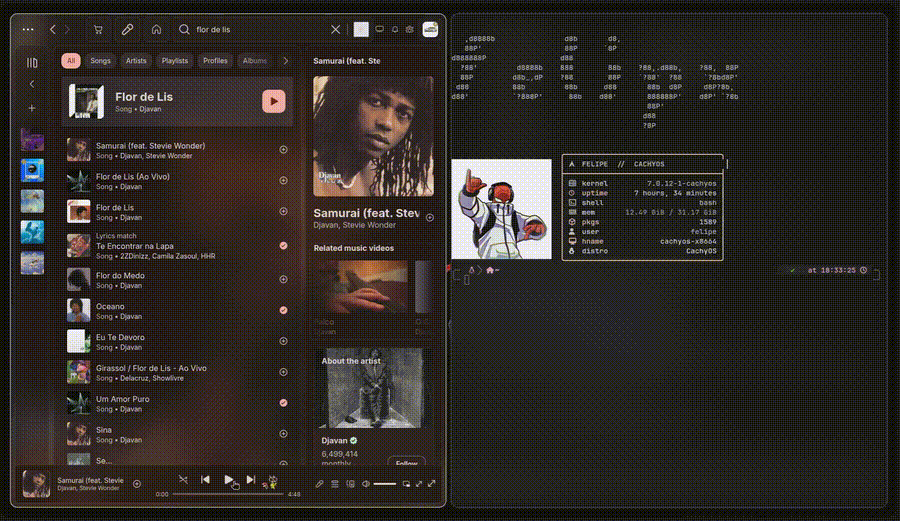
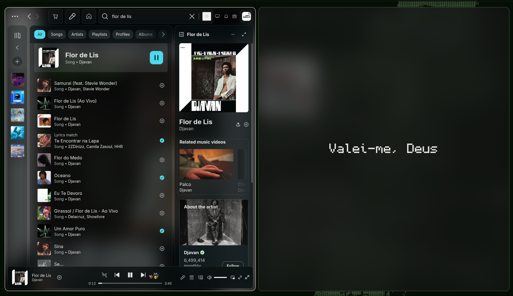

# Lyrics Terminal

Sistema de letras sincronizadas para Spotify no Linux.

## Demonstração

Versão em vídeo: [demo.mp4](assets/demo.mp4)

## Instalação

1. Garanta estas dependências no sistema: `go`, `python3`, `playerctl`, `kitty`, `sptlrx`.
2. Execute `./install.sh` na raiz do projeto.
3. O script compila `lyrics-fetch-go` e instala os binários em `~/.local/bin/`.

## Comandos

- `lyrics`: comando principal.
- `lyrics-local`: usa `.lrc` local sincronizado.
- `lyrics-fetch-go`: busca `.lrc` em providers externos, mostra métricas com `--stats`, faz teste sem salvar com `--dry-run` e analisa falhas com `--analyze-failures`.
- Log principal: `~/.cache/lyrics-terminal/lyrics.log`

## Uso

- `lyrics`: abre uma janela Kitty dedicada com Monocraft 32.
- `lyrics --current`: executa o fluxo no terminal atual.
- `lyrics --kitty`: abre uma nova janela do Kitty.
- `lyrics --run`: mantém compatibilidade e executa no terminal atual.
- `lyrics --health`: verifica dependências e arquivos principais.
- `lyrics --version`: mostra versão, commit e data de build quando disponível.
- `lyrics --debug`: abre Kitty com logs de debug.
- `lyrics --current --debug`: executa no terminal atual com logs de debug.
- `lyrics --kitty --debug`: abre Kitty com logs de debug.
- `lyrics-local --debug --run`: roda diretamente o renderer de `.lrc` local.
- `lyrics-fetch-go --debug`: busca e salva a letra sincronizada do Spotify atual.
- `lyrics-fetch-go --stats`: mostra estatísticas do índice e do cache.
- `lyrics-fetch-go --dry-run --debug`: executa a busca sem salvar `.lrc`.
- `lyrics-fetch-go --analyze-failures`: consolida falhas persistidas, quarentena e cache negativo em um relatório.

No modo `--current`, a fonte e o tamanho passam a ser controlados pelo terminal atual.

## Fluxo

1. `lyrics` verifica se já existe `.lrc` local válido.
2. Se existir e passar na validação, usa `lyrics-local`.
3. Se não existir, usa `sptlrx pipe`.
4. Em background, chama `lyrics-fetch-go` para tentar baixar a letra.

Arquivos `.lrc` suspeitos são movidos para `~/.local/share/lyrics/bad/` e tratados como cache miss.

## Pastas

- Letras locais: `~/.local/share/lyrics/`
- Cache: `~/.cache/lyrics-terminal/`

## Dependências

- `kitty`
- `playerctl`
- `sptlrx`
- `go`, apenas para build
