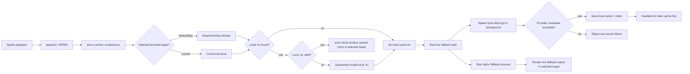

# Development Guide

## 1. Title and Purpose

This document is for contributors and maintainers who need to understand the current architecture, run the project locally, debug failures, and make safe changes without relying on hidden context.

The codebase is treated as the source of truth. If older notes or docs disagree with the implementation, follow the code and treat the mismatch as a documentation issue.

## 2. Project Scope

Lyrics Terminal is a Linux-focused terminal lyrics project built around Spotify playback through MPRIS and `playerctl`.

It does:

- detect the current Spotify track
- reuse valid local `.lrc` files
- fetch synchronized lyrics from providers when needed
- validate cache entries before reuse
- quarantine suspicious local `.lrc` files
- render lyrics in the terminal or in a dedicated Kitty window
- expose health, stats, and failure-analysis commands

It does not try to:

- promise full product stability yet
- support non-Linux platforms as a first-class target
- treat every provider result as trustworthy without validation
- replace Spotify, MPRIS, or `playerctl`
- add large features during the real-world testing phase without evidence

Current focus:

- Linux
- Spotify
- MPRIS
- terminal rendering
- real-world testing and observation

The project is functional, but it is still in real-world testing. Stability should not be promised as if the system were final.

## 3. Repository Layout

```text
assets/                 README media and screenshots
docs/                   Maintainer docs, analysis notes, and testing criteria
lyrics_fetch_go/        Go fetcher, cache validation, quarantine, stats, and failure analysis
scripts/                Python runtime entrypoints for lyrics and lyrics-local
tests/                  Python integration tests for runtime behavior
install.sh              Local installer that builds and copies the runtime pieces
lyricslib.py            Shared Python runtime helpers and rendering/logging logic
README.md               Public project overview and user-facing usage notes
```

Important files and responsibilities:

- `scripts/lyrics`: main user-facing launcher and runtime orchestrator
- `scripts/lyrics-local`: local `.lrc` playback helper
- `lyrics_fetch_go/main.go`: CLI entrypoint for the fetcher and diagnostics
- `lyrics_fetch_go/cache.go`: cache lookup, validation, quarantine, and local save logic
- `lyrics_fetch_go/providers.go`: provider pipeline and provider-level validation
- `lyrics_fetch_go/diagnostics.go`: stats output
- `lyrics_fetch_go/failure_analysis.go`: failure analysis output and aggregation
- `lyricslib.py`: shared rendering, logging, metadata, and cache helpers for Python runtime
- `install.sh`: builds `lyrics-fetch-go` and installs the runtime to `~/.local/bin`
- `docs/`: technical notes, bug history, provider analysis, and testing policy

## 4. Runtime Architecture



How the flow works:

- Spotify exposes track and playback metadata through MPRIS.
- The Python runtime asks `playerctl` for status, track metadata, and playback position.
- The runtime chooses a terminal target first: detached Kitty by default, or the current terminal when requested.
- The runtime checks the local `.lrc` cache before trying live fetching.
- If a valid local `.lrc` is present, `lyrics-local` renders it in the selected target.
- If no valid local `.lrc` exists, the main runtime starts `lyrics-fetch-go` in the background and starts `sptlrx` as the fallback live rendering process.
- The Go fetcher queries providers, validates candidate lyrics, and writes accepted results back to the local cache.
- Invalid local `.lrc` files are moved to quarantine so they are not reused.
- Rendering happens in the terminal, either inside the current terminal or inside a detached Kitty window.

The important architectural point is that runtime, fetcher, cache validation, and diagnostics are separate responsibilities. They coordinate through subprocesses, shared files, and cache directories rather than one large monolithic process.

## 5. Entry Points and Execution Modes

### `lyrics`

Use this for normal user-facing playback.

What it does:

- reads Spotify metadata through `playerctl`
- checks for a valid local `.lrc`
- runs `lyrics-local` when a local cache hit exists
- otherwise starts background fetching with `lyrics-fetch-go` and live fallback rendering with `sptlrx`

Important dependencies:

- `python3`
- `playerctl`
- `kitty`
- `sptlrx`

Known limits:

- depends on Spotify being visible through MPRIS
- will not work well if `playerctl` cannot read the current player state
- live rendering depends on `sptlrx` being installed and functional

Mode behavior:

- `lyrics` opens the detached Kitty window by default
- `lyrics --kitty` is the explicit alias for the same Kitty behavior
- `lyrics --current` runs in the current terminal

### `lyrics --kitty`

Use this when you want the lyrics in a dedicated Kitty window.

What it does:

- launches a detached Kitty instance
- passes rendering overrides from `lyricslib.py`
- re-enters the same runtime in `--run` mode

Important dependencies:

- `kitty`
- `python3`
- `playerctl`

Known limits:

- requires Kitty to be installed and in `PATH`
- if Kitty is missing, launch fails immediately

### `lyrics --current`

Use this when you want lyrics rendered in the current terminal instead of a detached Kitty window.

What it does:

- runs the main runtime loop in the current terminal
- uses the same Spotify detection, cache validation, and fallback logic
- renders centered terminal output directly

Important dependencies:

- `python3`
- `playerctl`

Known limits:

- terminal appearance depends on the current terminal emulator
- the current terminal mode does not create the detached Kitty window experience

### `lyrics --health`

Use this to check whether the environment is ready.

What it does:

- checks `playerctl`, `kitty`, `sptlrx`, and `lyrics-fetch-go` in `PATH`
- checks cache and index directories
- checks whether `index.json` is valid JSON
- checks Spotify status through `playerctl`

Important dependencies:

- `playerctl`
- `kitty`
- `sptlrx`
- `lyrics-fetch-go`

Known limits:

- this is a health snapshot, not a full runtime test
- a PASS on health does not guarantee that a specific track will fetch correctly

### `lyrics --version`

Use this to inspect build metadata.

What it does:

- prints version, commit, and build date from `lyricslib.version_info()`

Important dependencies:

- build info file written by `install.sh`, or git metadata as fallback

Known limits:

- if the binary is not installed with build info and git metadata is unavailable, values fall back to `dev` and `unknown`

### `lyrics-fetch-go --stats`

Use this to inspect cache and provider statistics.

What it does:

- counts local `.lrc` files
- counts quarantined files
- counts negative cache files
- summarizes statuses and providers from the index
- prints recent searches

Important dependencies:

- the Go binary
- cache and index files under `~/.cache/lyrics-terminal/`
- local `.lrc` files under `~/.local/share/lyrics/`

Known limits:

- stats are only as accurate as the persisted index and current cache state

### `lyrics-fetch-go --analyze-failures`

Use this to triage wrong lyrics, missing lyrics, cache corruption, and provider behavior.

What it does:

- reads persisted failure events
- reads the search index
- scans quarantine and negative-cache directories
- prints category counts, provider counts, failed song entries, and resolution hints

Important dependencies:

- the Go binary
- `~/.cache/lyrics-terminal/failures.jsonl`
- `~/.cache/lyrics-terminal/index.json`
- `~/.local/share/lyrics/bad/`

Known limits:

- the analysis is only as good as the events that were recorded
- older failures can be overwritten in the index, so the JSONL failure log matters for history

### `lyrics-fetch-go --clear-cache`

This command exists in the Go CLI, but it is destructive and should be used carefully.

It removes the entire `~/.cache/lyrics-terminal/` tree, including:

- `lyrics.log`
- `index.json`
- `failures.jsonl`
- `negative/`
- any other cache files written there

It does not remove local lyrics under `~/.local/share/lyrics/`.

## 6. Responsibilities by Language and Component

### Go

The Go module under `lyrics_fetch_go/` is responsible for:

- fetching lyrics from providers
- validating provider candidates
- validating local cache entries before reuse
- quarantining invalid `.lrc` files
- writing cache and index data
- producing stats and failure-analysis output
- maintaining the fetcher-side test suite

### Python

The Python runtime under `scripts/` and `lyricslib.py` is responsible for:

- command-line entrypoints
- runtime orchestration
- Spotify metadata polling through `playerctl`
- terminal rendering
- launching Kitty when requested
- launching the Go fetcher in the background
- choosing between local cache playback and live fallback
- logging runtime events

### Shell

`install.sh` is the shell entrypoint in the repository.

It is responsible for:

- checking required tools
- building `lyrics-fetch-go`
- copying runtime scripts into `~/.local/bin`
- writing build metadata into the cache directory

### Communication between components

The components communicate through:

- subprocess calls
- shared cache files
- index files
- failure logs
- quarantine directories

The main runtime does not need to know provider internals. It needs to know whether a valid local `.lrc` exists, whether live rendering is available, and whether the background fetcher is making progress.

## 7. Lyrics Fetching and Provider Pipeline

Current provider order in `lyrics_fetch_go/providers.go`:

1. LRCLIB
2. NetEase via map
3. NetEase search
4. `syncedlyrics` CLI

How the pipeline works:

- LRCLIB is queried first with one or more search shapes.
- Each LRCLIB candidate is validated against track title, artist presence, duration tolerance, and synced-line presence.
- NetEase via map looks up a mapped ID first, then fetches lyrics by ID.
- NetEase search scores candidate songs before lyric fetch.
- `syncedlyrics` is treated as a fallback CLI source and is only accepted when output is non-empty, validated, and synced.

Acceptance and rejection:

- title mismatch rejects a candidate
- artist mismatch rejects a candidate
- duration differences above the tolerance reject a candidate
- plain text without synced timestamps rejects a candidate
- empty provider output is treated as not found or invalid, depending on context

Why a provider can be technically valid but still semantically wrong:

- the code validates metadata similarity, not song meaning
- a wrong live version, remix, alternate cut, or near-match title can still pass if the metadata resembles the target track closely enough
- provider output may contain synced timestamps while still belonging to the wrong recording

That is why provider expansion should be data-driven. A new provider should not be added by impulse. It needs evidence for coverage, quality, and latency.

## 8. Cache, Validation and Quarantine

This area is intentionally strict.

### Cache locations

- local lyrics: `~/.local/share/lyrics/`
- cache and index: `~/.cache/lyrics-terminal/`
- quarantine: `~/.local/share/lyrics/bad/`

### How cache paths are calculated

The code calculates two local `.lrc` paths for a track:

- exact cache path, based on sanitized artist and title values
- normalized cache path, based on normalized artist and title values

The exact and normalized names are both used so that the runtime can reuse a valid file even if one naming style is missing.

The fetcher also falls back to scanning `*.lrc` files under the local lyrics directory when the exact and normalized names do not match directly but the normalized stem still matches the current track key.

### Cache validation rules

A local `.lrc` file is treated as invalid when it is:

- empty
- missing parseable timestamps
- made only of non-useful lyric lines
- suspiciously CJK-heavy for a track whose metadata is Latin-script or Portuguese-leaning

Validation happens before reuse. Existence alone is not enough.

### Quarantine behavior

When a local `.lrc` is invalid, it is moved into:

- `~/.local/share/lyrics/bad/`

The quarantine file keeps the original content for later inspection. This is important because a bad local file must stop influencing future runs, but the bad data should still be available for debugging.

### Fallback between cache paths

If the exact local path is invalid but a normalized path is valid, the invalid file is quarantined and the valid file is still reused.

This protects against one bad cache entry blocking a good one with the same track key.

### Why this exists

The project must not trust an old or malformed `.lrc` just because it is already on disk.

### How `cache_test.go` protects against regressions

The Go regression tests cover:

- valid cache reuse
- empty cache files
- cache files with no timestamps
- cache files with timestamps but no useful lyric lines
- CJK mismatch quarantine for Latin-track metadata
- valid CJK lyrics for a CJK track
- fallback from invalid exact path to valid normalized path
- missing cache behavior without panic or accidental quarantine

The tests use temporary directories and isolate the global cache-path variables so they do not touch the real HOME directory.

## 9. Observability and Diagnostics

### Log location

Runtime logs are written to:

- `~/.cache/lyrics-terminal/lyrics.log`

### Main runtime events

The Python runtime logs events such as:

- startup
- track detection
- track change
- playback pause and resume
- cache hit
- cache miss
- cache invalid
- quarantine
- fetch spawn
- provider selection
- fetch success
- fetch failure

The Go code also logs cache and provider events through its own debug and event paths.

### Log rotation

Log rotation exists.

Implementation detail:

- up to 5 log files are kept
- each file is capped at 5 MB

### Stats and failure analysis

```bash
lyrics --health
lyrics-fetch-go --stats
lyrics-fetch-go --analyze-failures
```

Relevant files:

- `~/.cache/lyrics-terminal/lyrics.log`
- `~/.cache/lyrics-terminal/index.json`
- `~/.cache/lyrics-terminal/failures.jsonl`
- `~/.cache/lyrics-terminal/negative/`
- `~/.local/share/lyrics/bad/`

How to use them:

- wrong lyrics: check the track metadata, provider selection, cache reuse, and quarantine history
- no lyrics found: check whether it is a coverage gap or a provider failure
- timeout: check provider timeouts and the failure log
- cache invalid: check quarantine contents and the cache path that was reused
- odd behavior after track change: check `track_changed`, `pipeline_restart`, and playback state logs

### Safe diagnostic examples

```bash
lyrics --health
lyrics-fetch-go --stats
lyrics-fetch-go --analyze-failures
```

These commands are read-only from the perspective of project state, except for any command that explicitly clears cache.

## 10. Local Development Setup

This project is developed on Linux.

Expected tools:

- `go`
- `python3`
- `playerctl`
- `kitty`
- `sptlrx`

The repository does not provide a dedicated repo-local developer harness. The supported runtime path is the installed `lyrics` and `lyrics-fetch-go` pair, and the Python launcher resolves the fetcher relative to its own file path.

Install and build:

```bash
./install.sh
```

What the installer does:

- verifies the required commands are available
- builds the Go fetcher
- installs the Python scripts and fetcher binary into `~/.local/bin`
- writes build metadata into the cache directory

Important environment note:

- make sure `~/.local/bin` is in `PATH`
- if an older global install exists, confirm that the shell is resolving the local binaries you just installed

### Running the Checkout Directly

The checkout can be run directly, but `scripts/lyrics` does not add the repository root to `sys.path` on its own.
`lyricslib.py` lives at the repository root, so the direct checkout flow must set `PYTHONPATH=.`.

Use these commands from the repository root:

```bash
cd lyrics_fetch_go
GOCACHE=/tmp/codex-gocache go build -o ../scripts/lyrics-fetch-go .
cd ..
PYTHONPATH=. ./scripts/lyrics --version
PATH="$PWD/scripts:$PATH" PYTHONPATH=. ./scripts/lyrics --health
PATH="$PWD/scripts:$PATH" PYTHONPATH=. sh -c 'command -v lyrics-fetch-go; readlink -f "$(command -v lyrics-fetch-go)"'
```

What these commands confirm:

- `scripts/lyrics` is executable and can be run directly from the checkout
- `PYTHONPATH=.` is required so the launcher can import `lyricslib.py` from the repository root
- `lyrics-fetch-go` must live at `scripts/lyrics-fetch-go`, because the launcher resolves it with `Path(__file__).with_name("lyrics-fetch-go")`
- the `PATH="$PWD/scripts:$PATH"` prefix ensures the checkout copy is found before any `~/.local/bin` install
- `--version` is a safe launcher check that does not depend on Spotify playback
- `--health` is a safe checkout check that does not require Spotify to be actively playing

If you do want to use the installed binary pair instead of the checkout, put `~/.local/bin` first in `PATH` and run `./install.sh`.

When you are intentionally using the installed pair, confirm which binary is active with:

```bash
command -v lyrics
readlink -f "$(command -v lyrics)"
command -v lyrics-fetch-go
readlink -f "$(command -v lyrics-fetch-go)"
```

Useful local checks:

```bash
lyrics --health
lyrics --version
```

How to run locally:

- use `lyrics` for the standard runtime
- use `lyrics --current` for current-terminal rendering
- use `lyrics --kitty` for the detached Kitty window
- use `lyrics --health` to confirm the environment before investigating runtime issues

## 11. Testing

Go tests:

```bash
cd lyrics_fetch_go
go test ./...
```

What the current tests cover:

- cache validation and quarantine regression cases in `lyrics_fetch_go/cache_test.go`
- provider and fetcher helper behavior in `lyrics_fetch_go/main_test.go`
- stats output in `lyrics_fetch_go/diagnostics_test.go`
- failure analysis output in `lyrics_fetch_go/failure_analysis_test.go`
- dry-run behavior in `lyrics_fetch_go/main_test.go`
- runtime routing, health, version, Kitty launch, and pause/resume behavior in `tests/test_lyrics_playlist.py`

Testing rules to keep:

- do not use the real HOME directory in tests that touch cache paths
- use temporary directories for path isolation
- do not depend on network, Spotify, playerctl state, or provider availability for unit tests
- do not use `t.Parallel()` in tests that mutate package-global path variables

The path-isolation tests in `lyrics_fetch_go/cache_test.go` follow this rule by restoring globals with `t.Cleanup()`.

## 12. Debugging Playbook

### Wrong lyrics displayed

```text
1. Confirm the detected track metadata.
2. Check ~/.cache/lyrics-terminal/lyrics.log.
3. Inspect lyrics-fetch-go --analyze-failures.
4. Check whether the lyrics came from cache reuse or a live fetch.
5. Inspect ~/.local/share/lyrics/bad/ for quarantined files.
6. Record the evidence before deleting anything.
```

What to look for:

- wrong artist/title matching
- a provider candidate that passed validation but was still the wrong song
- a bad local `.lrc` being reused

### No lyrics found

```text
1. Confirm artist, title, and duration.
2. Check lyrics.log and failures.jsonl.
3. Determine whether the system hit a real coverage gap or a provider failure.
4. Do not mark every missing lyric as a bug automatically.
```

What to distinguish:

- no provider coverage
- provider timeout
- provider unavailable
- metadata mismatch

### Track change or pause/resume issue

```text
1. Verify playerctl can see Spotify.
2. Check logs for track_detected, track_changed, spotify_paused, and spotify_resumed.
3. Check whether the failure is in player detection, the pipeline restart, or rendering.
```

### Cache issue

```text
1. Locate the local .lrc file.
2. Confirm whether the file was reused from cache.
3. Check whether it was invalidated or moved into quarantine.
4. Do not delete cache files blindly before collecting evidence.
```

## 13. Safe Change Guidelines

- keep changes small and isolated
- test before committing
- avoid rewrites without a reason
- do not add a provider just because it is available
- do not change cache behavior without regression tests
- do not use `git push --force` on the main branch
- document architectural changes when they matter
- record real bugs in issues
- keep the current real-world testing phase free of large speculative features

## 14. Known Limitations

Current known limitations, based on the current code and docs:

- Linux focus only
- depends on Spotify being exposed through MPRIS and `playerctl`
- provider coverage is limited by the available backends
- `sptlrx` is optional but required for live fallback rendering
- the project is still in real-world testing
- the current terminal mode does not provide the same detached-window experience as Kitty

## 15. Related Documentation

- [Project README](../README.md)
- [Real World Testing Exit Criteria](REAL_WORLD_TESTING.md)
- [Architecture notes](Arquitetura.md)
- [Bug notes](Bugs.md)
- [Technical decisions](Decisoes.md)
- [Failure analysis](Providers/Failure-Analysis.md)
